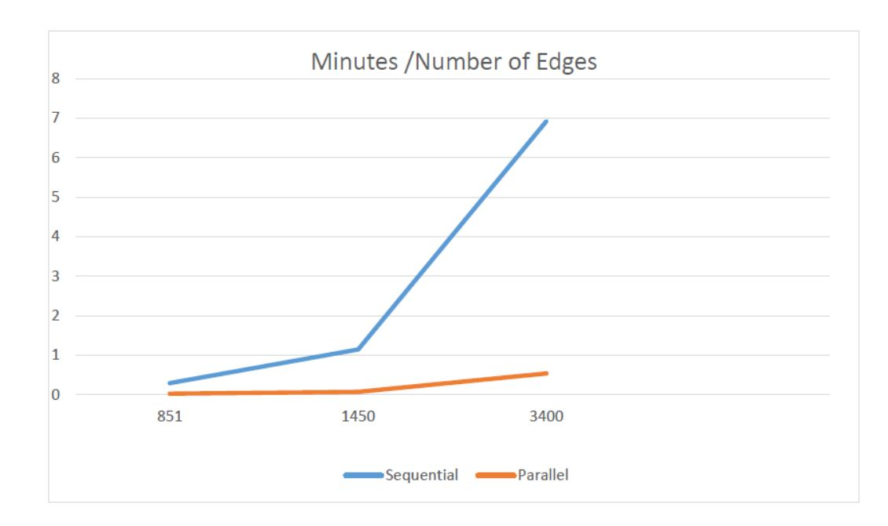
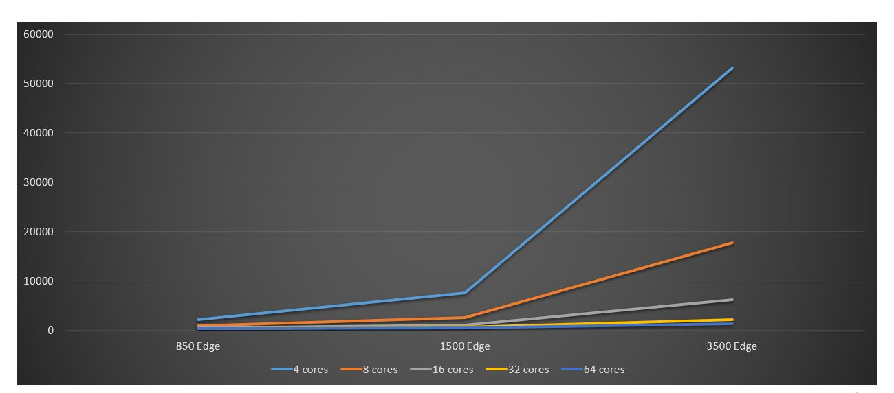

**Parallel Influence Maximization On Social Networks**


Influence Maximization On Social Networks

Abstract:

A social network is a structure made up of individuals who are tied by one or more specific types

of relationship or interdependency, such as friendship, co-authorship ...etc. The issue at hand is

trying to maximize influence on such networks by finding a number K of the most influential

nodes. The problem of influence maximization deals with choosing the optimal set of nodes in a

social network so as to maximize the spread of a technology (opinion, product-ownership, etc.),

given a model of diffusion of influence in a network. In this paper we will attempt to optimize the

execution time by parallelizing the algorithm which is used to solve this problem.

Introduction:

In a network every node v has an influence threshold bvw ≥ 0, in order for v to become active

(influenced) all of its active neighbors should exert influence > bvw, once active v can then itself

exert influence onto its neighbors (Figure 1) and thus every node is both considered for its

influence threshold is and its power to influence, in this case considering networks with millions

of nodes is very computationally heavy as one node might have a large number of neighbors which

need to be activated, on the other hand some nodes might not have connections allowing them to

be influenced and therefore in all cases the retrieval of the nodes that ensure maximum influence

is very computationally demanding, in a parallel implementation the different processors will be

able to divide the workload and retain a speed up in the process. Moreover, social networks are

only increasing with more and more interconnectedness (Figure 2) happening and thus a faster

implementation of this algorithm is rather necessary with the constant rise of the network’s nodes

and connections.


Figure 1

Step Description:

```
1 - Traverse the graph from the master processor and assign each processor a group of nodes
2 - Every processor will then take its subgraph of the nodes and return the list of nodes directly
influenced for each node in the subgraph.
3 - The master processor will then combine all the result to form an array of {node, list-
influenced}, which it will then split among the available processors and send to each its
sub-array.
4 - For this step, each processor will go through every node, and for every node go through
every friend in the its list and add their influenced friends to its list and at last send the
result to the master.
5 - Once the master receives from all processors it will combine the data and sort it by length
of list of influenced friends, which it will then return the kth most influential.
```

# Algorithm:

Every edge in the graph represents a “friendship” between 2 nodes on the graph it is weighted by

the number of interactions the two nodes have had, ex: {2 3 8} where nodes 2 and 3 are friends

that have interacted 8 times in some form, the power of influence for every node is thus the average

of all its interactions with other nodes thus the more interactions a node has had the more its

capable of influencing other nodes, recursively if node 2 has influenced node 3, and node 3 has

influenced node 4: then node 2 is considered to be capable of influencing both node 3 and 4 even


if no edge between node 2 and node 4 exists. On the other hand, in order for any node to directly

influence another, its average of total interactions needs to be greater than the number of

interactions it has had with the other node ex :

```
node 2 has an average of 13 interactions
```
```
node 3 has an average of 7 interactions
```
```
edge between node 2 and 3 has 8 interactions =>
```
```
13 > 8
```
```
7 < 8
```
```
node 2 can influence 3 ,
```
```
but node 3 cannot directly influence node 2.
```
# Data Set:

```
The Facebook-like Social Network originate from an online community for students at
University of California, Irvine. The dataset includes the users that sent or received
(interacted) at least one message (1,899) with each user. Weighted static two-mode network
(weighted by number of messages).
```
```
Source : https://toreopsahl.com/datasets/#online_forum_network
```
```
Data : http://opsahl.co.uk/tnet/datasets/OF_two-mode_weightedmsg.txt
```
# Sequential Algorithm:

After processing the data and setting a list of friends for each node, the algorithm goes through the

list of edges whereby it selects an edge and calculates its influence power by averaging all its

interactions by number of friendships (edges its part of), after doing so for all edges, the algorithm

goes through the list of edges for each node and checks whether a node has influenced (activated)

its friend, every influenced friend is added to a list connected to the said node.


After gathering the data of each node and who it influences directly, the second part of the

the algorithm then goes through each node in every list and adds its own list into the original list

whereby those are influenced indirectly.

# Sequential Tests


# Parallel Implementation:

The parallel implementation was done using a Node js library called cluster which is an extensible

multi-core server manager for node.js, that works by creating a Master process which creates a

Worker processors for every core available in the system, the master can communicate with the

workers and vice versa and are able to send them any data type. The workers also exit upon finishing

their task and the master can then replace them by forking another worker to use up the idle core

which results in zero downtime.

In this case, the master will first process the data as that is the least heavy part of the algorithm,

and then split up the processed data into chunks for every worker, each worker will take its chunk

and compute the list of influenced nodes for every node in the chunk (every worker has access to

both its own chunk and the total array of edges). After which the worker will send the array of

nodes and their lists back to the master and exit.

Once the master receives all the data from all the workers and after all the workers from the first

set has died, it will fork a new set of workers for every available core, then it will split up the

combined data once more and send every worker a chunk.

In this phase, each worker will go through the nodes of its chunk and traverse its list of influence

nodes, for every influenced node its own list of influenced nodes will be added to the main list for

the said node. Once again, the worker will send its array to the master and exist.

Whenever the master receives a message with the flag “second” (showing that it’s from the 2 nd

batch of workers) it will merge it with the main array of nodes and lists.


When all the workers from the 2nd batch have died, the master will then sort the final combined

array by the length of the influenced list and return the kth most influential nodes.


# Parallel Tests:




# Conclusion:

The tests show a significant speedup from the sequential algorithm:


Sources

```
 Node js Cluster Liberty: https://github.com/LearnBoost/cluster
```
```
 Dataset: http://opsahl.co.uk/tnet/datasets/OF_two-mode_weightedmsg.txt
```
References:

https://www.cs.cornell.edu/home/kleinber/kdd03-inf.pdf

https://www.sciencedirect.com/science/article/pii/S0957417414005867

https://ieeexplore.ieee.org/abstract/document/6137225

https://github.com/GiorgosPanagopoulos/DiffuGreedy-Influence-Maximization

https://www.ncbi.nlm.nih.gov/pmc/articles/PMC5495484/

https://www.researchgate.net/publication/257553299_Scalable_influence_maximization_for_ind

ependent_cascade_model_in_large-scale_social_networks

Coding Notes:

Regular Expression used to parse data into an array of objects: ([0-9] *) ([0-9] *) ([0-9] *)

Replace: {node: [$1, $2], power: $3 }


